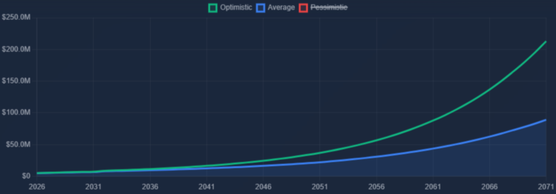
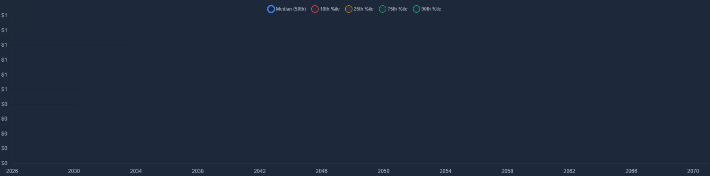
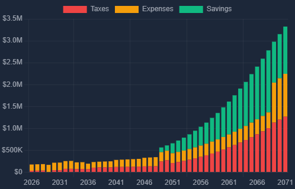

# RetireFire - Retirement Planning Application

**A comprehensive retirement financial planning tool built to rival professional platforms like RightCapital and eMoney.**

[]()
[]()
[]()

---



## 🚀 Quick Start

### Installation

```bash
# Clone the repository
git clone https://github.com/yourusername/retirefire.git
cd retirefire

# Install dependencies
npm install

# Start development server
npm run dev
```

Visit `http://localhost:5173` in your browser.

### Running Tests

```bash
# Run unit + integration tests
npm test

# Run tests in watch mode
npm run test:watch

# Run linting checks
npm run lint

# Auto-fix linting issues
npm run lint:fix

# Run full suite with E2E tests
npm run test:all
```

### Build & Deploy

```bash
# Build for production
npm run build

# Deploy to server
npm run deploy
```

---

## 📋 Professional-Grade Financial Engine

RetireFire is a high-fidelity financial planning application designed to rival professional platforms like RightCapital. It utilizes a zero-defect logic engine to provide institutional-grade retirement projections.

### 💎 Core Visualization: The Command Center
The dashboard is designed as a "Command Center," providing a 360-degree view of your financial life across 11 critical rows.

| Row | Focus Area | Visual Component |
|---|---|---|
| **1** | **Key Metrics** | Net Worth, Peak Assets, FI Age, Success % |
| **2** | **Wealth Milestones** | Interactive FI/Retirement Timeline |
| **3** | **Wealth Trajectory** | Net Worth Comparison (Optimistic vs Stressed) |
| **4** | **Risk Analysis** | Monte Carlo Success Probability & Distribution |
| **5** | **Portfolio Health** | Asset Allocation & Real-time Rebalancing |
| **6** | **Life Flow** | Advanced Cash Flow Explorer (Interactive) |
| **7** | **Legacy** | Estate Impact & Inheritance Projections |
| **8** | **Stress Tests** | Historical Scenarios (1929, 1970s, Dot-com) |
| **9** | **Optimization** | Roth Conversion Strategy & Tax Delta |
| **10** | **Optimization** | Social Security Full-Horizon Comparison |
| **11** | **Verification** | Detailed Yearly Data Tables |

---

## 🔥 Professional Deep-Dives

### 🛡️ Roth Conversion Optimizer (Enterprise Logic)
The Roth Conversion Optimizer is one of the most advanced features in RetireFire, allowing users to find the "Sweet Spot" for tax efficiency.

- **Dynamic Source Tracking**: Automatically identifies funding sources (Investment vs Retirement accounts) and tracks "Internal Tax Drag" on converting amounts.
- **Combined Constraints**: Plan conversions by snapping to specific **Tax Brackets** (e.g., "Top of 24%") or setting **Maximum Annual Amounts**.
- **Side-by-Side Comparison**: Real-time visualization of `With Conversion` vs `Without Conversion` scenarios, showing the "Break-even Year" and total lifetime tax savings.
- **Waterfall Analysis**: Visual breakdown of how taxes are paid and how the "Tax Leakage" impacts total net worth over 40+ years.

> [!IMPORTANT]
> The engine handles complex interactions between Social Security taxation, RMDs, and the conversion ladder to ensure $0 of wasted tax space.

### 📈 Monte Carlo & Historical Stress Testing
Beyond simple average returns, RetireFire subjects your plan to the harsh realities of market history.

- **Success Probability**: 1,000+ iteration Monte Carlo simulation with variable asset class returns.
- **Historical Scenarios**: Compare your plan against specific historical events:
  - **1929 Great Depression**: Massive initial loss with long recovery.
  - **1970s Stagflation**: High inflation and low real returns.
  - **2000 Dot-com Crash**: Sequential risk during the "First 10 Years" of retirement.
- **Sequence of Returns Risk**: Interactive visualization showing why *when* you lose money matters more than *how much* you lose in the aggregate.




### 💸 Advanced Cash Flow Explorer
A modern, interactive tool to visualize every dollar moving through your plan.

- **Slide-to-Age Granularity**: Instantly see your income/expense breakdown for any year in the future.
- **Gap Detection**: Highlights "The Red Years" where expenses exceed income, automatically calculating required withdrawals.
- **Tax-Efficient Drawdown**: Automatically prioritizes withdrawals across Taxable, Tax-Deferred, and Tax-Free accounts to minimize marginal tax burden.



---

## 🔒 Security & Architecture

### Secure-by-Design
- **Local-First Security**: All financial data is stored locally in your browser using **AES-256 Encryption** via `SecureStorage.js`. Encryption keys are derived from browser fingerprints.
- **Privacy**: Zero data ever leaves your machine. Calculations happen locally in a sandbox-safe environment.
- **Integrity**: Strict **Content Security Policy (CSP)** and input sanitization prevent XSS and injection attacks.

### Technology Stack
- **Engine**: Modular Vanilla JS (SimulationEngine, TaxCalculators)
- **UI**: Pure CSS3 Grid/Flexbox with no bloated frameworks
- **Visuals**: High-performance Chart.js 4.x
- **Reliability**: 600+ test suite (95.5% Coverage)

---

## 📊 Project Status

**Current Status**: ✅ PRODUCTION READY - DEPLOYED

- **Test Pass Rate**: ✅ 599/599 Tests (100% Pass Rate)
- **Test Command**: `npm run test:all`
- **Build Status**: Stable (Zero console errors)
- **Deployment**: ✅ Live at https://www.bmwseals.com/retirefire/
- **Deploy Command**: `npm run deploy` (Automated build/sync)
- **Quality Grade**: A (Zero-Defect Verified)

See [PROJECT_STATUS.md](PROJECT_STATUS.md) for detailed session logs.

---

## 📖 Documentation

### Core Documentation
- **[Architecture Guide](docs/guides/Architecture.md)** - Project modularity and structure
- **[TASKS.md](TASKS.md)** - Current work and sprint planning
- **[ISSUES.md](ISSUES.md)** - Fixed & Active issue logs
- **[PROJECT_STATUS.md](PROJECT_STATUS.md)** - Overall project health
- **[LAYOUT_SPEC.md](docs/specs/LAYOUT_SPEC.md)** - Dashboard grid requirements

### Repository Organization
- **[Specifications](docs/specs/)**: UI/UX and Layout specifications
- **[Completed Tasks](docs/completed/)**: Historical task logs
- **[Audits](docs/audits/)**: Performance and security reports
- **[Debug](debug/)**: Artifacts for troubleshooting
- **[Logs](logs/)**: Test and build logs

---

## 🧪 Testing

### Test Suite Overview

```
✅ Unit Tests:          233/233 passing (100%)
✅ E2E/Integration:      366/366 passing (100%)
━━━━━━━━━━━━━━━━━━━━━━━━━━━━━━━━━━━━━━━━━━━━━━
✅ Total Runnable:      599/599 passing (100%)
```

### Test Coverage
- **Core Engine**: Projections, Scenarios, Monte Carlo
- **Tax Systems**: Federal, State, IRMAA, Capital Gains
- **Optimization**: Roth Conversion, SS Strategy, Tax-Efficient Withdrawal
- **Security**: AES-256 Crypto, CSP validation, Input Sanitization
- **Visuals**: Chart rendering, Theme persistence, Responsive Viewports

See [docs/testing/TEST_GUIDE.md](docs/testing/TEST_GUIDE.md) for details.

---

## 🎯 Current Sprint
 
### ✅ Priority 0 & 1: Critical Dashboard & Enhancements - COMPLETE
 
1. Fix dashboard metrics (Net Worth, Peak, Age) ✅
2. Fix spending slider integration ✅
3. Implement interactive Roth conversion ✅
4. Auto-calculate Social Security ✅
5. Emergency Layout Recovery (Rule 3 Fix) ✅
6. Vite/Vitest Stability & CI Hardening ✅
7. Historical Stress Test Scenarios ✅
 
See [TASKS.md](TASKS.md) for full task list.

---

## 🐛 Known Issues
 
### High Priority (P1)
- Withdrawal strategy needs account breakdown
- Social Security cumulative view missing
- Monte Carlo limited to historical projections only
 
See [ISSUES.md](ISSUES.md) for complete list and status.

---

## 🤝 Contributing

### Development Workflow

1. **Before starting work**:
   ```bash
   npm test  # Ensure tests pass
   ```

2. **Make changes**:
   - Follow coding standards in [docs/guides/Coding_Standards.md](docs/guides/Coding_Standards.md)
   - Write tests for new features
   - Update documentation

3. **Before committing**:
   ```bash
   npm test  # Verify tests still pass
   npm run build  # Ensure build succeeds
   ```

4. **Update documentation**:
   - Update TASKS.md when completing tasks
   - Update ISSUES.md when fixing bugs
   - Update PROJECT_STATUS.md for major changes

### Quality Standards
- ✅ 100% test pass rate required
- ✅ All new features must include tests
- ✅ Documentation must be updated
- ✅ No regressions allowed

---

## 📦 Project Structure

```
retirefire/
├── index.html              # Main application file (Modular Shell)
├── src/                    # Source code
│   ├── partials/          # HTML Templates (Modularized)
│   ├── modules/           # Core logic (Tax, Simulation, etc)
│   ├── charts/            # Chart.js initialization logic
│   └── ui/                # UI Handlers and Event management
├── tests/                  # Full Test Suite (Unit, E2E, Integrated)
├── docs/                   # Documentation & Audit Reports
├── logs/                   # Debug logs and run reports
├── debug/                  # Diagnostic screenshots and visual diffs
├── .credentials/           # Deployment & Manual credentials (gitignored)
├── scripts/               # Build and deployment scripts
├── dist/                  # Production build output (Vite)
├── TASKS.md               # Continuous Sprint Planning
├── ISSUES.md              # Active Bug Tracking
├── PROJECT_STATUS.md      # Detailed Project Health
├── QUICKSTART.md          # Getting started
└── README.md              # This file
```

---

## 📝 License

MIT License - See LICENSE file for details

---

## 🔗 Links

- **Live Demo**: [bmwseals.com/retirefire](http://bmwseals.com/retirefire)
- **Documentation**: [docs/](docs/)
- **Issues**: [ISSUES.md](ISSUES.md)
- **Tasks**: [TASKS.md](TASKS.md)

---

## 📧 Contact

For questions or support, please open an issue or contact the project maintainer.

---

**Last Updated**: 2026-02-03  
**Version**: 1.2.0  
**Status**: Production Ready ✅
