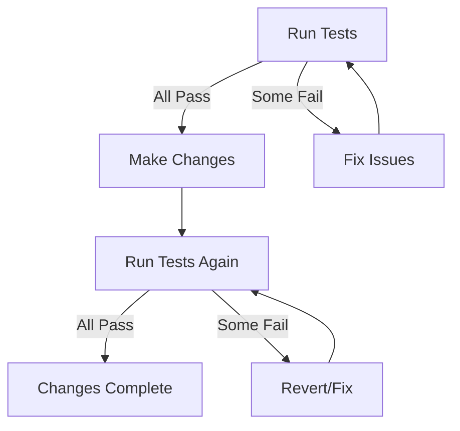

# Automated Testing Workflow

## Quick Start

```bash
# Run all tests
node tests/run_tests.js

# Or use npm script
npm test
```

## Test Categories

### 1. File Integrity Tests 📁
- Verifies ray3.html exists and is valid size
- Checks for critical code patterns
- Confirms all required sections present

### 2. JavaScript Syntax Tests 🔧
- Balanced braces, parentheses, brackets
- No common syntax errors
- Valid object structures

### 3. Data Structure Tests 📊
- All scenarios exist (optimistic/average/pessimistic)
- 46 years of data present
- All account types configured
- All income sources defined

### 4. Configuration Tests ⚙️
- Mortgage years is 8 (correct value)
- Roth conversion settings exist
- Annual spending configured
- Start year is 2026

### 5. Chart Configuration Tests 📈
- All chart init functions exist
- All canvas elements present
- Charts properly configured

### 6. Calculation Function Tests 🧮
- Core calculation functions exist
- Toggle functions work
- Helper functions available

---

## Pre-Update Workflow

**ALWAYS run tests before making code changes!**

```bash
# Step 1: Validate current state
npm test

# Step 2: If tests pass, make your changes
# ... edit ray3.html ...

# Step 3: Run tests again after changes
npm test

# Step 4: If tests fail, fix the issues
# ... fix problems ...

# Step 5: Repeat until all tests pass
```

---

## Adding New Tests

Edit `tests/run_tests.js` to add new validations:

```javascript
async runYourNewTests() {
    this.log('\n🆕 YOUR NEW TESTS', 'blue');
    
    // Add your checks here
    if (someCondition) {
        this.pass('Your test description');
    } else {
        this.fail('Your test description', 'Error message');
    }
}
```

Then add to `runAll()`:
```javascript
await this.runYourNewTests();
```

---

## Test Results

Results are saved to `tests/last_test_results.json` after each run:

```json
{
  "timestamp": "2026-01-19T17:00:00.000Z",
  "passed": 45,
  "failed": 0,
  "skipped": 0,
  "duration": "1.23",
  "errors": []
}
```

---

## Continuous Improvement Cycle



---

## Exit Codes

| Code | Meaning |
|------|---------|
| 0 | All tests passed |
| 1 | One or more tests failed |

Use in scripts:
```bash
npm test && echo "Safe to deploy" || echo "DO NOT DEPLOY"
```
